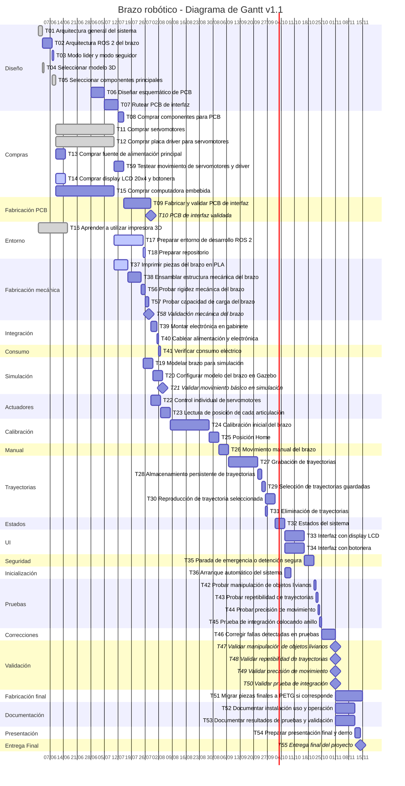

# Diagrama de Gantt

```mermaid
%%{init: {"gantt": {"topAxis": true}} }%%
gantt
    title Brazo robótico - Diagrama de Gantt v1.1
    dateFormat  YYYY-MM-DD
    axisFormat  %d/%m
    tickInterval 1week

    section Diseño
    T01 Arquitectura general del sistema                     :done, t01, 2026-06-01, 2d
    T02 Arquitectura ROS 2 del brazo                         :t02, after t01, 5d
    T03 Modo lider y modo seguidor                           :active, t03, after t01 t02, 1d
    T04 Seleccionar modelo 3D                                :done, t04, after t01, 1d
    T05 Seleccionar componentes principales                  :done, t05, after t01 t02 t04, 2d
    T06 Diseñar esquemático de PCB                           :t06, 2026-06-28, 7d
    T07 Rutear PCB de interfaz                               :t07, after t06, 7d

    section Compras
    T08 Comprar componentes para PCB                         :t08, after t06 t07, 3d
    T11 Comprar servomotores                                 :done, t11, after t05, 30d
    T12 Comprar placa driver para servomotores               :done, t12, after t05, 30d
    T13 Comprar fuente de alimentación principal             :t13, after t05, 5d
    T59 Testear movimiento de servomotores y driver          :t59, after t11 t12 t13, 5d
    T14 Comprar display LCD 20x4 y botonera                  :active, t14, after t05, 5d
    T15 Comprar computadora embebida                         :t15, after t05, 30d

    section Fabricación PCB
    T09 Fabricar y validar PCB de interfaz                   :t09, after t07 t08, 14d
    T10 PCB de interfaz validada                             :milestone, t10, after t09, 0d

    section Entorno
    T16 Aprender a utilizar impresora 3D                     :done, t16, 2026-06-01, 15d
    T17 Preparar entorno de desarrollo ROS 2                 :active, t17, after t02 t15, 15d
    T18 Preparar repositorio                                 :active, t18, after t17, 1d

    section Fabricación mecánica
    T37 Imprimir piezas del brazo en PLA                     :active, t37, after t04 t11 t16, 7d
    T38 Ensamblar estructura mecánica del brazo              :t38, after t11 t37, 7d
    T56 Probar rigidez mecánica del brazo                    :t56, after t38, 2d
    T57 Probar capacidad de carga del brazo                  :t57, after t38 t56, 2d
    T58 Validación mecánica del brazo                        :milestone, t58, after t56 t57, 0d

    section Integración
    T39 Montar electrónica en gabinete                       :t39, after t10 t11 t12 t13 t14 t15 t38, 3d
    T40 Cablear alimentación y electrónica                   :t40, after t10 t38 t39, 1d

    section Consumo
    T41 Verificar consumo eléctrico                          :t41, after t40, 1d

    section Simulación
    T19 Modelar brazo para simulación                        :t19, after t04 t17, 5d
    T20 Configurar modelo del brazo en Gazebo                :t20, after t19, 5d
    T21 Validar movimiento básico en simulación              :milestone, t21, after t20, 0d

    section Actuadores
    T22 Control individual de servomotores                   :t22, after t10 t11 t12 t17 t18, 5d
    T23 Lectura de posición de cada articulación             :t23, after t22, 5d

    section Calibración
    T24 Calibración inicial del brazo                        :t24, after t23, 20d
    T25 Posición Home                                        :t25, after t24, 5d

    section Manual
    T26 Movimiento manual del brazo                          :t26, after t22 t23 t25, 5d

    section Trayectorias
    T27 Grabación de trayectorias                            :t27, after t23 t26, 15d
    T28 Almacenamiento persistente de trayectorias           :t28, after t27, 2d
    T29 Selección de trayectorias guardadas                  :t29, after t28, 2d
    T30 Reproducción de trayectoria seleccionada             :t30, after t28 t29, 5d
    T31 Eliminación de trayectorias                          :t31, after t28 t29, 1d

    section Estados
    T32 Estados del sistema                                  :t32, after t27 t30 t31, 5d

    section UI
    T33 Interfaz con display LCD                             :t33, after t10 t14 t32, 10d
    T34 Interfaz con botonera                                :t34, after t10 t14 t32, 10d

    section Seguridad
    T35 Parada de emergencia o detención segura              :t35, after t22 t30 t32 t34, 5d

    section Inicialización
    T36 Arranque automático del sistema                      :t36, after t15 t17 t18 t32, 3d

    section Pruebas
    T42 Probar manipulación de objetos livianos              :t42, after t30 t35 t38 t40 t41, 1d
    T43 Probar repetibilidad de trayectorias                 :t43, after t42, 1d
    T44 Probar precisión de movimiento                       :t44, after t42 t43, 1d
    T45 Prueba de integración colocando anillo               :t45, after t44, 1d

    section Correcciones
    T46 Corregir fallas detectadas en pruebas                :t46, after t42 t43 t44 t45, 7d

    section Validación
    T47 Validar manipulación de objetos livianos             :milestone, t47, after t42 t46, 0d
    T48 Validar repetibilidad de trayectorias                :milestone, t48, after t43 t46, 0d
    T49 Validar precisión de movimiento                      :milestone, t49, after t44 t46, 0d
    T50 Validar prueba de integración                        :milestone, t50, after t45 t46, 0d

    section Fabricación final
    T51 Migrar piezas finales a PETG si corresponde          :t51, after t16 t46, 14d

    section Documentación
    T52 Documentar instalación uso y operación               :t52, after t33 t34 t36 t46 t50, 10d
    T53 Documentar resultados de pruebas y validación        :t53, after t41 t42 t43 t44 t45 t46 t47 t48 t49 t50, 10d

    section Presentación
    T54 Preparar presentación final y demo                   :t54, after t52 t53, 3d

    section Entrega Final
    T55 Entrega final del proyecto                           :milestone, t55, after t54, 0d
```
