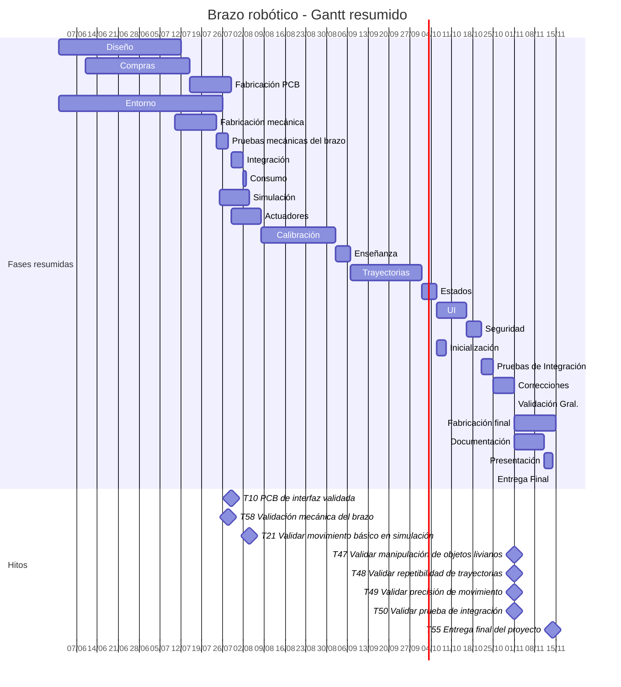

```mermaid
%%{init: {"gantt": {"topAxis": true}} }%%
gantt
    title Brazo robótico - Gantt resumido
    dateFormat  YYYY-MM-DD
    axisFormat  %d/%m
    tickInterval 1week

    section Fases resumidas
    Diseño                         :fase_diseno, 2026-06-01, 2026-07-12
    Compras                        :fase_compras, 2026-06-10, 2026-07-15
    Fabricación PCB                :fase_pcb, 2026-07-15, 2026-07-29
    Entorno                        :fase_entorno, 2026-06-01, 2026-07-26
    Fabricación mecánica           :fase_fab_mec, 2026-07-10, 2026-07-24
    Pruebas mecánicas del brazo    :fase_pruebas_mec, 2026-07-24, 2026-07-28
    Integración                    :fase_integracion, 2026-07-29, 2026-08-02
    Consumo                        :fase_consumo, 2026-08-02, 2026-08-03
    Simulación                     :fase_simulacion, 2026-07-25, 2026-08-04
    Actuadores                     :fase_actuadores, 2026-07-29, 2026-08-08
    Calibración                    :fase_calibracion, 2026-08-08, 2026-09-02
    Enseñanza                      :fase_ensenanza, 2026-09-02, 2026-09-07
    Trayectorias                   :fase_trayectorias, 2026-09-07, 2026-10-01
    Estados                        :fase_estados, 2026-10-01, 2026-10-06
    UI                             :fase_ui, 2026-10-06, 2026-10-16
    Seguridad                      :fase_seguridad, 2026-10-16, 2026-10-21
    Inicialización                 :fase_inicializacion, 2026-10-06, 2026-10-09
    Pruebas de Integración         :fase_pruebas_int, 2026-10-21, 2026-10-25
    Correcciones                   :fase_correcciones, 2026-10-25, 2026-11-01
    Validación Gral.               :fase_validacion, 2026-11-01, 2026-11-01
    Fabricación final              :fase_fab_final, 2026-11-01, 2026-11-15
    Documentación                  :fase_documentacion, 2026-11-01, 2026-11-11
    Presentación                   :fase_presentacion, 2026-11-11, 2026-11-14
    Entrega Final                  :fase_entrega, 2026-11-14, 2026-11-14

    section Hitos
    T10 PCB de interfaz validada                       :milestone, hito_t10, 2026-07-29, 0d
    T58 Validación mecánica del brazo                  :milestone, hito_t58, 2026-07-28, 0d
    T21 Validar movimiento básico en simulación        :milestone, hito_t21, 2026-08-04, 0d
    T47 Validar manipulación de objetos livianos       :milestone, hito_t47, 2026-11-01, 0d
    T48 Validar repetibilidad de trayectorias          :milestone, hito_t48, 2026-11-01, 0d
    T49 Validar precisión de movimiento                :milestone, hito_t49, 2026-11-01, 0d
    T50 Validar prueba de integración                  :milestone, hito_t50, 2026-11-01, 0d
    T55 Entrega final del proyecto                     :milestone, hito_t55, 2026-11-14, 0d
```
