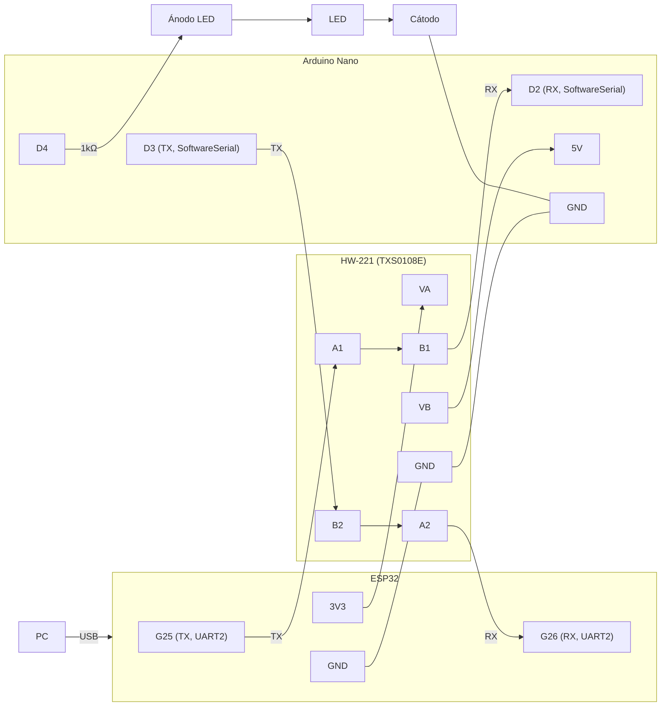
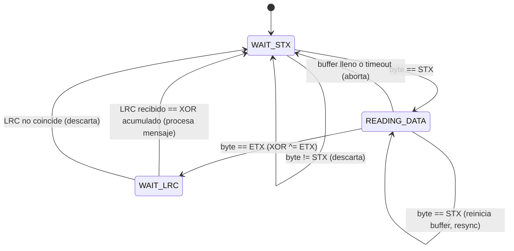

# Bitácora — E05: Probar TX-RX ESP32 con Arduino Nano

## Objetivo
Probar el código UART del ESP32 (de E01) comunicándose con un Arduino Nano, programando este último para enviar y recibir mensajes por los pines TX-RX.

## Decisiones tomadas

- **Hace falta un conversor de nivel lógico bidireccional entre ambas placas.** El ESP32 trabaja con lógica de 3.3V (confirmado en E02: VL=0V, VH=3.29V) y el Arduino Nano trabaja con lógica de 5V — no se pueden conectar TX-RX directo entre ambos.
- **Módulo disponible: HW-221**, con un chip marcado **YF08E**.
  - Investigado y confirmado: **YF08E no es un chip distinto ni un clon** — es el código de marcado (topside marking) que Texas Instruments graba en el paquete TSSOP-20 del **TXS0108E**, su traductor de nivel bidireccional de 8 bits. El datasheet correspondiente es el oficial de TI para el TXS0108E.
  - Guardado en `doc/datasheets/txs0108e.pdf`.
  - Specs relevantes: VCCA acepta 1.2V–3.6V, VCCB acepta 1.65V–5.5V, traducción bidireccional no inversora, compatible con UART/I2C/SPI — encaja para el par 3.3V (ESP32) / 5V (Arduino Nano).
- **Pin OE (Output Enable) del TXS0108E:** entrada digital referenciada a VCCA. En alto habilita la traducción normal en todos los pines A/B; en bajo, todos los pines A1-A8/B1-B8 pasan a alta impedancia (chip "apagado" a nivel de señal). Su propósito según el datasheet es evitar glitches durante power-up/power-down.
  - Verificado con el multímetro en modo continuidad en el módulo HW-221: **OE está puenteado a VCCA en la placa** → queda siempre habilitado apenas se alimenta el módulo, no requiere manejo aparte.

## Circuito objetivo

```
PC --USB--> ESP32 (G25 TX/G26 RX) <--UART2--> HW-221 <--SoftwareSerial--> Arduino Nano --D4/res--> LED
```

Objetivo funcional: enviar "ON"/"OFF" desde la PC (por el monitor serie del ESP32, UART0/USB) y que el ESP32 lo retransmita por UART2 al Arduino Nano a través del HW-221, que a su vez prenda/apague el LED en D9.



### Tabla de conexiones

| ESP32 | HW-221 | Arduino Nano | LED / resistencia |
|-------|--------|--------------|---------------------|
| GND   | GND    | GND          | Cátodo (K)          |
| 3V3   | VA     |              |                      |
| G25 (TX, UART2) | A1 |         |                      |
| G26 (RX, UART2) | A2 |         |                      |
|       | VB     | 5V           |                      |
|       | B1     | D2 (RX, SoftwareSerial) |          |
|       | B2     | D3 (TX, SoftwareSerial) |          |
|       |        | D4           | → resistencia 1kΩ → Ánodo (A) |

### Decisiones de diseño

- **Mapeo de canales A/B validado:** G25 (TX ESP32) → A1 → B1 → D2 (RX Nano); D3 (TX Nano) → B2 → A2 → G26 (RX ESP32). El shifter no cruza TX/RX por sí mismo (solo traduce voltaje por canal) — el cruce lógico lo da la asignación D2=RX/D3=TX del lado Nano.
- **UART2 reasignado de G17/G16 a G25/G26** por comodidad de cableado (pines del otro lado físico de la placa). Verificado que no hay atadura de hardware: el datasheet ESP32-WROOM-32 (sección 4.2.3, pág. 17) confirma que "the pins for UART can be chosen from any GPIOs via the GPIO Matrix" — 16/17 eran solo el default del ejemplo de Kconfig. G25/G26 están dentro del rango válido para TXD/RXD (0-33, Kconfig `env_caps`), no son strapping pins (Tabla 3) ni están reservados para el flash SPI (nota² de la Tabla 2, pág. 9-10). Se descartó G34/G35 para este cambio porque son *input-only* (Type "I" en la Tabla 2) y no sirven para TX.
- **D2/D3 con `SoftwareSerial` en el Nano, no D0/D1 (UART hardware):** se dejan D0/D1 libres para conectar el Nano también a la PC y poder ver por monitor serie lo que recibe — mismo criterio que UART0 del ESP32 reservado para el monitor en E01.
- **Baud rate: 9600** para el enlace UART2 (ESP32) ↔ SoftwareSerial (Nano). Se bajó de los 115200 usados en E01 porque `SoftwareSerial` es bit-banging por software y no es confiable a baudios altos. **Pendiente:** UART2 del ESP32 está configurado a 115200 vía Kconfig desde E01 — hay que reconfigurarlo a 9600 (vía `menuconfig`) para que coincida con el Nano, o usar una tercera UART/instancia a 9600 separada de la que se usa con la PC.
- **LED con resistencia limitadora de 1kΩ en serie** (D4 → resistencia → ánodo, cátodo → GND) — corrige el problema visto en E02 de conectar un LED directo a un pin sin resistencia. Con 5V y una caída típica de LED (~2V), da ~3mA: corriente baja pero segura, LED va a verse tenue. D4 elegido en vez de D9 por comodidad de cableado en la protoboard.

## Protocolo de framing (STX/FS/ETX/LRC)

Pensado para que el mismo parser sirva tanto para "ON"/"OFF" (E05) como para comandos multi-campo (E06, control de servos).

### Constantes

| Campo | Valor  | Descripción |
|-------|--------|-------------|
| STX   | 0x02   | Inicio de mensaje |
| FS    | 0x1C   | Separador de campos |
| ETX   | 0x03   | Fin de mensaje |
| LRC   | XOR    | XOR de todos los bytes desde el primero después del STX hasta el ETX inclusive |

### Máquina de estados del receptor



## Lecciones aprendidas (debug del Nano standalone)

- **Reset por DTR al abrir el puerto serie:** al abrir la conexión desde un script (`pyserial`), la línea DTR resetea físicamente la placa (mismo mecanismo que usa el IDE para subir sin botón físico). Si se escribe apenas se abre el puerto, los bytes se pierden porque el Nano todavía está reseteando/arrancando `setup()`. Solución: esperar ~2s después de abrir el puerto antes de escribir (`firmware/arduino-uart-test/send_cmd.py`).
- **El Arduino IDE no detecta cambios externos del archivo en disco:** si el `.ino` se edita fuera del IDE mientras el sketch está abierto, el IDE sigue mostrando (y compilando/subiendo) su copia vieja en memoria. Hay que cerrar y reabrir el sketch para que tome los cambios del disco.
- **Truco de validación de build:** agregar `Serial.println(__DATE__ " " __TIME__);` en `setup()` para confirmar en cada test que el build corriendo en la placa es el que se acaba de compilar (útil para descartar "código viejo" como causa de un bug).
- **Bug de diseño: el estado `FULL_PKG` nunca se ejecutaba.** La máquina de estados original tenía un estado extra `FULL_PKG` al que se transicionaba desde `WAIT_LRC` cuando el LRC coincidía. El problema: cambiar la variable `uart_state` no ejecuta el `case` correspondiente — eso solo pasa cuando el `switch` se vuelve a evaluar con el próximo byte. Como el frame termina exactamente en el byte del LRC, no llegaba ningún byte extra para disparar el `case FULL_PKG`, y el mensaje quedaba sin procesar indefinidamente. **Fix:** se eliminó el estado `FULL_PKG` y el procesamiento (`processRcvMsg()` + `resetFSM()`) se movió directo adentro del `if(checkLrc(rcvByte))`, así se ejecuta en el mismo byte que confirma el LRC.

## Próximos pasos

- [ ] Cablear el circuito según la tabla de conexiones
- [x] Revisar en el datasheet del TXS0108E el pin OE (output enable) y confirmar cómo debe quedar habilitado en el módulo HW-221
- [x] Programar el Arduino Nano: `SoftwareSerial` en D2(RX)/D3(TX) a 9600 baudios, control de LED en D4 según comandos "ON"/"OFF" — probado standalone por USB (protocolo STX/FS/ETX/LRC) con `firmware/arduino-uart-test/send_cmd.py`, funcionando en ambas direcciones (ON/OFF)
- [ ] Adaptar el código del ESP32 (UART2) para retransmitir lo recibido por USB/UART0 hacia el Arduino, y viceversa
- [ ] Validar comunicación end-to-end: PC → ESP32 → HW-221 → Arduino → LED
