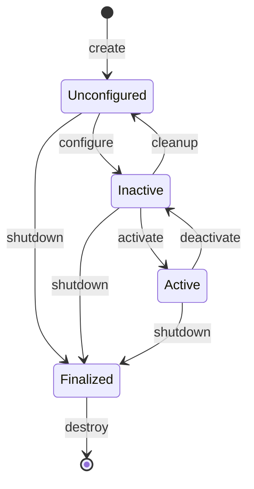

# Bitácora [R11] — Lifecycle node (managed node) en ROS2

_Inicio: 2026-09-24_

## Contexto

Estudiar cómo funciona un lifecycle node (managed node) en ROS2.

## Máquina de estados



## Troubleshooting: build de `simple_lifecycle_node.py` en `robotic_arm_remote`

### 1. `ModuleNotFoundError: No module named 'ament_package'`

```
File "/opt/ros/jazzy/share/ament_cmake_core/cmake/package_templates/templates_2_cmake.py", line 21
ModuleNotFoundError: No module named 'ament_package'
CMake Error at CMakeLists.txt:8 (find_package)
```

**Causa:** entorno de ROS no cargado en la terminal. `ament_package` no está en el Python del sistema, vive en `/opt/ros/jazzy/lib/python3.12/site-packages` y solo es visible si `PYTHONPATH` lo incluye (lo setea el `source` de ROS).

Falló solo `robotic_arm_remote` porque su `CMakeLists.txt` había cambiado y forzó una reconfiguración de CMake; el resto de los paquetes usó la configuración cacheada y no ejecutó ese script.

**Solución:** cargar el entorno antes de compilar (en zsh, el `.zsh`, no el `.bash`):

```bash
source /opt/ros/jazzy/setup.zsh
colcon build
```

### 2. `install PROGRAMS given unknown argument`

```
CMake Error at CMakeLists.txt:20 (install):
  install PROGRAMS given unknown argument "simple_lifecycle_node".
```

Código que fallaba:

```cmake
install(PROGRAMS
  ${PROJECT_NAME}/task_server.py simple_lifecycle_node.py
  DESTINATION lib/${PROJECT_NAME}
  RENAME task_server simple_lifecycle_node
)
```

Dos errores:
- **`RENAME` acepta un solo nombre** y solo sirve cuando el `install` instala un solo archivo. CMake tomó `task_server` como valor de `RENAME` y no supo qué hacer con `simple_lifecycle_node`.
- **Ruta incompleta:** `simple_lifecycle_node.py` está dentro de la carpeta del módulo, le faltaba el prefijo `${PROJECT_NAME}/`.

**Solución:** un `install(PROGRAMS ...)` por archivo:

```cmake
install(PROGRAMS
  ${PROJECT_NAME}/task_server.py
  DESTINATION lib/${PROJECT_NAME}
  RENAME task_server
)

install(PROGRAMS
  ${PROJECT_NAME}/simple_lifecycle_node.py
  DESTINATION lib/${PROJECT_NAME}
  RENAME simple_lifecycle_node
)
```

## Por qué un lifecycle node

Un nodo común hace todo en el constructor. Ejemplo: `simple_serial_receiver` de `[R10]` abre el puerto serie en `__init__`; si el puerto no existe, `serial.Serial()` tira `SerialException` y el proceso muere. Tampoco hay forma de cambiar el `port` sin matar el nodo y relanzarlo.

El lifecycle node separa **existir** (`unconfigured`), **estar listo** (`inactive`) y **estar trabajando** (`active`). Cada transición del diagrama llama a un callback propio: `on_configure`, `on_activate`, `on_deactivate`, `on_cleanup`, `on_shutdown`.

## Nodo de prueba: `simple_lifecycle_node.py`

`robotic_arm_ws/src/robotic_arm_remote/robotic_arm_remote/simple_lifecycle_node.py`:
- Hereda de `rclpy.lifecycle.Node`.
- `on_configure`: crea la suscripción a `chatter`.
- `on_activate`: `time.sleep(2)` y `super().on_activate(state)`.
- `on_cleanup` / `on_shutdown`: destruyen la suscripción.
- `msgCallback`: imprime `I heard: ...` solo si `self._state_machine.current_state[1] == "active"` (`current_state` es una tupla `(id, label)`).

Error encontrado antes de correrlo: `rclpy.executors.SigleThreadedExecutor` → typo, es `SingleThreadedExecutor` (`AttributeError`).

## Prueba manual de transiciones

```bash
# T1
ros2 run robotic_arm_remote simple_lifecycle_node
# T2: publisher continuo
ros2 topic pub /chatter std_msgs/msg/String "{data: 'hi'}"
# T3: inspección y transiciones
ros2 lifecycle nodes                              # lista solo nodos managed
ros2 lifecycle get  /simple_lifecycle_node        # estado actual
ros2 lifecycle list /simple_lifecycle_node        # transiciones disponibles desde el estado actual
ros2 lifecycle set  /simple_lifecycle_node <transición>
```

### Transiciones disponibles por estado (`ros2 lifecycle list`)

| Estado | Transición [ID] | Estado de transición (Goal) |
|---|---|---|
| `unconfigured [1]` | `configure [1]` | `configuring` |
| | `shutdown [5]` | `shuttingdown` |
| `inactive [2]` | `cleanup [2]` | `cleaningup` |
| | `activate [3]` | `activating` |
| | `shutdown [6]` | `shuttingdown` |
| `active [3]` | `deactivate [4]` | `deactivating` |
| | `shutdown [7]` | `shuttingdown` |

Observaciones:
- El `Goal` es un **estado de transición** (`configuring`, `activating`, ...), no el estado final. El diagrama de arriba solo muestra los estados primarios. Según el callback devuelva `SUCCESS` o `FAILURE`, el nodo termina en el estado destino o vuelve al de origen.
- `shutdown` tiene un ID distinto según el estado de origen (5, 6, 7): son transiciones diferentes con el mismo nombre. En el CLI conviene usar el nombre, no el número.

### Resultados

**`unconfigured`:** `ros2 topic list` no muestra `/chatter` (con el publisher apagado). La suscripción todavía no existe porque `on_configure` no corrió.

**`configure` → `inactive`:** aparece `on_configure() called` y `/chatter` en `ros2 topic list`. La suscripción se crea al configurar, no al activar. Con el publisher corriendo, no aparece ningún `I heard`.

**`activate` → `active`:**

```
09.780  on_activate() called
11.784  I heard: hi   ← 2 s después, por el sleep
11.786  I heard: hi   ← 2 ms después del anterior
12.455  I heard: hi   ← desde acá, uno por segundo
```

- `time.sleep(2)` en `on_activate` **bloquea el executor**: durante 2 s el nodo no atiende ningún callback (mismo problema que `readline()` en `[R10]`).
- Los mensajes que llegan durante el sleep quedan en la **cola de la suscripción** (depth 10, último argumento de `create_subscription`) y se atienden en ráfaga cuando el executor se libera.

**`deactivate` → `inactive` y `activate` de nuevo:** transiciones exitosas.

## Preguntas resueltas

### 1. En `inactive`, ¿los mensajes llegan a `msgCallback`?

**Sí, llegan y los filtra el `if`.** En rclpy, `create_subscription` crea una suscripción común aunque el nodo sea lifecycle: recibe mensajes en cualquier estado desde que existe (`on_configure`). El filtrado por estado queda a cargo del código.

Lo que sí respeta el estado son los publishers creados con `create_lifecycle_publisher` (`LifecyclePublisher`): en `inactive` descartan lo publicado.

### 2. `shutdown` directo desde `unconfigured`

Con el código original:

```python
def on_shutdown(self, state: State) -> TransitionCallbackReturn:
    self.destroy_subscription(self.sub_)
    ...
```

Resultado: `Transitioning failed` en T2, **nada en T1**, y el nodo queda en `unconfigured [1]` (no se apagó).

**Causa:** `on_configure` nunca corrió, así que `self.sub_` no existe → `AttributeError`. rclpy atrapa la excepción del callback **sin loguearla** (`rclpy/lifecycle/node.py`, `__execute_callback`):

```python
try:
    ret = cb(previous_state)
    return ret
except Exception:
    # TODO(ivanpauno): log sth here
    return TransitionCallbackReturn.ERROR
```

Secuencia:
1. `shutdown` → estado de transición `shuttingdown` → `on_shutdown` → `AttributeError`.
2. rclpy devuelve `ERROR` → estado de transición `errorprocessing` → `on_error`.
3. El `on_error` por defecto (sin entidades managed) devuelve `SUCCESS` → el nodo vuelve a `unconfigured`.

Retornos de un callback de transición:
- `SUCCESS`: pasa al estado destino.
- `FAILURE`: "no pude, sigo en pie" → vuelve al estado de origen.
- `ERROR`: "rompí" → pasa por `errorprocessing`.

**Lección:** en rclpy, una excepción dentro de un callback de transición es silenciosa. Si una transición falla sin log, sospechar de una excepción en el callback.

#### Intento intermedio (incorrecto)

```python
def on_shutdown(self, state: State) -> TransitionCallbackReturn:
    self.get_logger().info("Lifecycle Node on_shutdown() called.")
    return self.destroy_subscription(self.sub_)
```

- Mover el log arriba solo sirve para diagnosticar: la línea que falla sigue siendo la misma.
- `destroy_subscription()` devuelve `bool`, no `TransitionCallbackReturn`.
- `on_cleanup` destruía la suscripción dos veces.

#### Solución: inicializar en `None`

```python
def __init__(self, node_name, **kwargs):
    self.sub_ = None
    super().__init__(node_name, **kwargs)

def on_shutdown(self, state: State) -> TransitionCallbackReturn:
    if self.sub_ is not None:
        self.destroy_subscription(self.sub_)
        self.sub_ = None
    self.get_logger().info("Lifecycle Node on_shutdown() called.")
    return TransitionCallbackReturn.SUCCESS
```

(`on_cleanup` igual.)

- `self.sub_ = None` en el constructor: el atributo existe siempre; `None` = "no hay nada creado".
- `is not None` y no `!= None`: `None` es un singleton, `is` compara identidad; `==`/`!=` puede redefinirse con `__eq__` (PEP 8). `if self.sub_:` evalúa "truthy", que no es lo mismo.
- `self.sub_ = None` después de destruir: rclpy tolera destruir dos veces (`destroy_subscription` devuelve `False`, verificado en `rclpy/node.py`), pero otros recursos (puerto serie, timers de otras librerías) no necesariamente. El `if` queda como única fuente de verdad sobre si el recurso existe.

#### Verificación

- `shutdown` desde `unconfigured` → `Transitioning successful`, `on_shutdown() called` en T1.
- `configure` → `cleanup` → `shutdown` → los tres callbacks en T1, todas las transiciones exitosas. Después de `cleanup`, `ros2 lifecycle list` vuelve a mostrar las transiciones de `unconfigured`.
- En `finalized`, `ros2 lifecycle list` sale vacío: no hay transiciones de salida.
- `finalized` **no termina el proceso**: el nodo sigue vivo hasta `Ctrl+C`. Matar el proceso queda a cargo de quien lo lanzó.

### 3. ¿En qué callback se abre el puerto serie y en cuál se arranca el timer?

- **Puerto serie → `on_configure`:** preparar el recurso. Puede fallar (puerto inexistente) y en ese caso se devuelve `FAILURE` sin matar el proceso.
- **Timer que publica → `on_activate`:** empezar a producir datos.

Separarlos permite verificar el hardware sin mandar nada y pausar con `deactivate` sin cerrar y reabrir el puerto.

_Completada: 2026-09-24_
