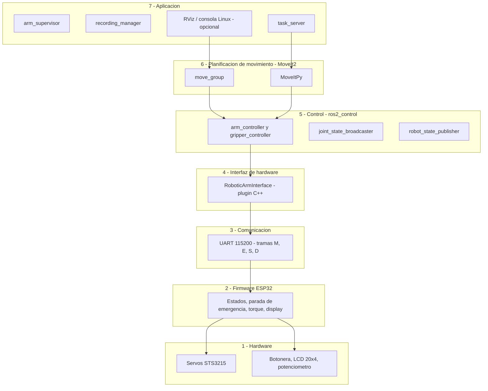

# Arquitectura por capas

```mermaid
flowchart TB
    subgraph L7[7 - Aplicacion]
        SUP[arm_supervisor]
        REC[recording_manager]
        TS[task_server]
        UI[RViz / consola Linux - opcional]
    end

    subgraph L6[6 - Planificacion de movimiento - MoveIt2]
        MG[move_group]
        MPY[MoveItPy]
    end

    subgraph L5[5 - Control - ros2_control]
        JTC[arm_controller y gripper_controller]
        JSB[joint_state_broadcaster]
        RSP[robot_state_publisher]
    end

    subgraph L4[4 - Interfaz de hardware]
        PLUGIN[RoboticArmInterface - plugin C++]
    end

    subgraph L3[3 - Comunicacion]
        UART[UART 115200 - tramas M, E, S, D]
    end

    subgraph L2[2 - Firmware ESP32]
        FW[Estados, parada de emergencia, torque, display]
    end

    subgraph L1[1 - Hardware]
        SERVOS[Servos STS3215]
        PANEL[Botonera, LCD 20x4, potenciometro]
    end

    TS --> MPY
    UI --> MG
    MG --> JTC
    MPY --> JTC
    JTC --> PLUGIN
    PLUGIN --> UART
    UART --> FW
    FW --> SERVOS
    FW --> PANEL
```
