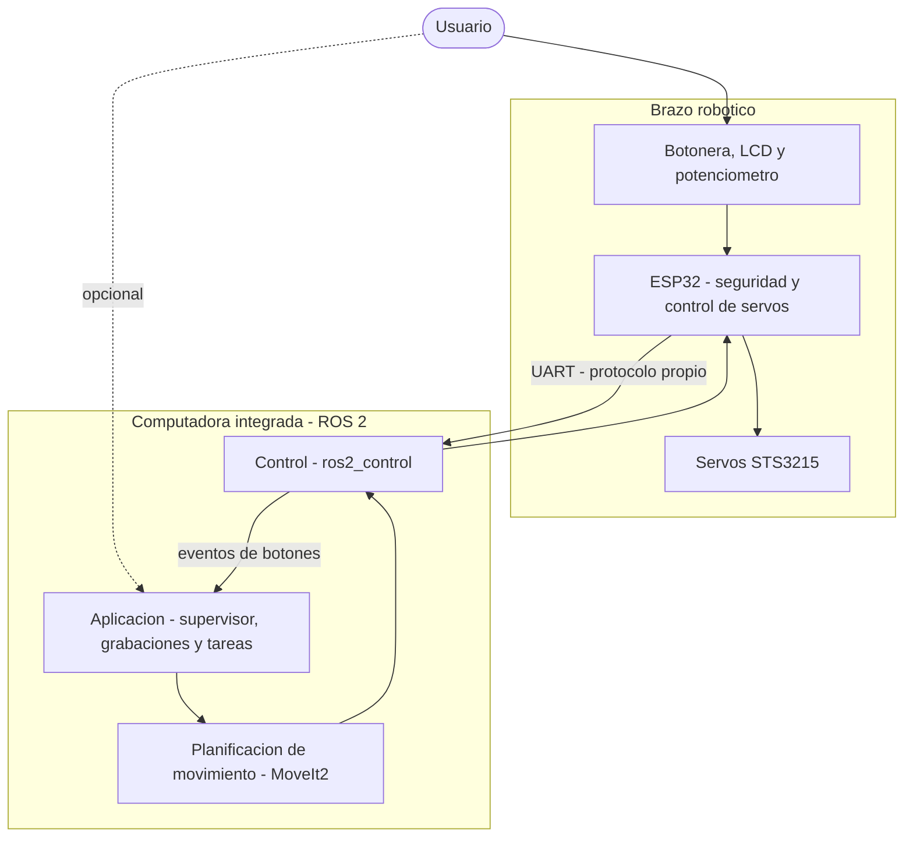

# Arquitectura general

```mermaid
flowchart TB
    USER([Usuario])

    subgraph HW[Brazo robotico]
        PANEL[Botonera, LCD y potenciometro]
        ESP[ESP32 - seguridad y control de servos]
        SERVOS[Servos STS3215]
    end

    subgraph PC[Computadora integrada - ROS 2]
        APP[Aplicacion - supervisor, grabaciones y tareas]
        MOTION[Planificacion de movimiento - MoveIt2]
        CTRL[Control - ros2_control]
    end

    USER --> PANEL
    USER -.->|opcional| APP
    PANEL --> ESP
    ESP --> SERVOS
    ESP -->|UART - protocolo propio| CTRL
    CTRL --> ESP
    CTRL -->|eventos de botones| APP
    APP --> MOTION
    MOTION --> CTRL
```
