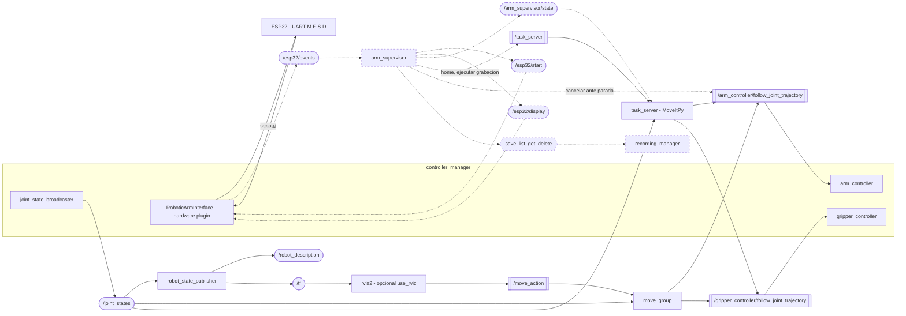

# Nodos, topics, actions y servicios ROS 2

```mermaid
flowchart LR
    subgraph CM[controller_manager]
        PLUGIN[RoboticArmInterface - hardware plugin]
        JSB[joint_state_broadcaster]
        ARM[arm_controller]
        GRIP[gripper_controller]
    end
    RSP[robot_state_publisher]
    MG[move_group]
    RVIZ[rviz2 - opcional use_rviz]
    TS[task_server - MoveItPy]
    SUP[arm_supervisor]
    REC[recording_manager]
    ESP[ESP32 - UART M E S D]

    T_JS(["/joint_states"])
    T_RD(["/robot_description"])
    T_TF(["/tf"])
    T_EV(["/esp32/events"])
    T_ST(["/esp32/start"])
    T_DI(["/esp32/display"])
    T_SS(["/arm_supervisor/state"])

    A_ARM[["/arm_controller/follow_joint_trajectory"]]
    A_GRIP[["/gripper_controller/follow_joint_trajectory"]]
    A_MOVE[["/move_action"]]
    A_TASK[["/task_server"]]

    S_REC{{"save, list, get, delete"}}

    ESP -->|serial| PLUGIN
    PLUGIN -->|serial| ESP

    JSB --> T_JS
    T_JS --> RSP
    T_JS --> MG
    T_JS --> TS
    RSP --> T_RD
    RSP --> T_TF
    T_TF --> RVIZ

    RVIZ --> A_MOVE
    A_MOVE --> MG
    MG --> A_ARM
    MG --> A_GRIP
    TS --> A_ARM
    TS --> A_GRIP
    A_ARM --> ARM
    A_GRIP --> GRIP

    PLUGIN -.-> T_EV
    T_EV -.-> SUP
    SUP -.-> T_ST
    T_ST -.-> PLUGIN
    SUP -.-> T_DI
    T_DI -.-> PLUGIN
    SUP -.-> T_SS
    T_SS -.-> TS

    SUP -.->|home, ejecutar grabacion| A_TASK
    A_TASK --> TS
    SUP -.->|cancelar ante parada| A_ARM
    SUP -.-> S_REC
    S_REC -.-> REC

    classDef planned stroke-dasharray: 5 5
    class SUP,REC,T_EV,T_ST,T_DI,T_SS,S_REC planned
```
