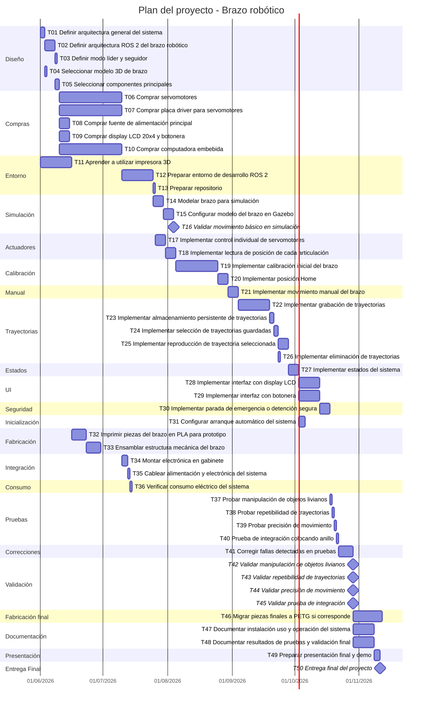

# Diagrama de Gantt

```mermaid
gantt
    title Plan del proyecto - Brazo robótico
    dateFormat  YYYY-MM-DD
    axisFormat  %d/%m/%Y

    section Diseño
    T01 Definir arquitectura general del sistema              :t01, 2026-06-01, 2d
    T02 Definir arquitectura ROS 2 del brazo robótico          :t02, after t01, 5d
    T03 Definir modo líder y seguidor                          :t03, after t01 t02, 1d
    T04 Seleccionar modelo 3D de brazo                         :t04, after t01, 1d
    T05 Seleccionar componentes principales                    :t05, after t01 t02 t04, 2d

    section Compras
    T06 Comprar servomotores                                   :t06, after t05, 30d
    T07 Comprar placa driver para servomotores                 :t07, after t05, 30d
    T08 Comprar fuente de alimentación principal               :t08, after t05, 5d
    T09 Comprar display LCD 20x4 y botonera                    :t09, after t05, 5d
    T10 Comprar computadora embebida                           :t10, after t05, 30d

    section Entorno
    T11 Aprender a utilizar impresora 3D                       :t11, 2026-06-01, 15d
    T12 Preparar entorno de desarrollo ROS 2                   :t12, after t02 t10, 15d
    T13 Preparar repositorio                                   :t13, after t12, 1d

    section Simulación
    T14 Modelar brazo para simulación                          :t14, after t04 t12, 5d
    T15 Configurar modelo del brazo en Gazebo                  :t15, after t14, 5d
    T16 Validar movimiento básico en simulación                :milestone, t16, after t15, 0d

    section Actuadores
    T17 Implementar control individual de servomotores         :t17, after t06 t07 t12 t13, 5d
    T18 Implementar lectura de posición de cada articulación   :t18, after t17, 5d

    section Calibración
    T19 Implementar calibración inicial del brazo              :t19, after t18, 20d
    T20 Implementar posición Home                              :t20, after t19, 5d

    section Manual
    T21 Implementar movimiento manual del brazo                :t21, after t17 t18 t20, 5d

    section Trayectorias
    T22 Implementar grabación de trayectorias                  :t22, after t18 t21, 15d
    T23 Implementar almacenamiento persistente de trayectorias :t23, after t22, 2d
    T24 Implementar selección de trayectorias guardadas        :t24, after t23, 2d
    T25 Implementar reproducción de trayectoria seleccionada   :t25, after t23 t24, 5d
    T26 Implementar eliminación de trayectorias                :t26, after t23 t24, 1d

    section Estados
    T27 Implementar estados del sistema                        :t27, after t22 t25 t26, 5d

    section UI
    T28 Implementar interfaz con display LCD                   :t28, after t09 t27, 10d
    T29 Implementar interfaz con botonera                      :t29, after t09 t27, 10d

    section Seguridad
    T30 Implementar parada de emergencia o detención segura    :t30, after t17 t25 t27 t29, 5d

    section Inicialización
    T31 Configurar arranque automático del sistema             :t31, after t10 t12 t13 t27, 3d

    section Fabricación
    T32 Imprimir piezas del brazo en PLA para prototipo        :t32, after t04 t11, 7d
    T33 Ensamblar estructura mecánica del brazo                :t33, after t32, 7d

    section Integración
    T34 Montar electrónica en gabinete                         :t34, after t06 t07 t08 t09 t10, 3d
    T35 Cablear alimentación y electrónica del sistema         :t35, after t33 t34, 1d

    section Consumo
    T36 Verificar consumo eléctrico del sistema                :t36, after t35, 1d

    section Pruebas
    T37 Probar manipulación de objetos livianos                :t37, after t25 t30 t33 t35 t36, 1d
    T38 Probar repetibilidad de trayectorias                   :t38, after t37, 1d
    T39 Probar precisión de movimiento                         :t39, after t37 t38, 1d
    T40 Prueba de integración colocando anillo                 :t40, after t39, 1d

    section Correcciones
    T41 Corregir fallas detectadas en pruebas                  :t41, after t37 t38 t39 t40, 7d

    section Validación
    T42 Validar manipulación de objetos livianos               :milestone, t42, after t37 t41, 0d
    T43 Validar repetibilidad de trayectorias                  :milestone, t43, after t38 t41, 0d
    T44 Validar precisión de movimiento                        :milestone, t44, after t39 t41, 0d
    T45 Validar prueba de integración                          :milestone, t45, after t40 t41, 0d

    section Fabricación final
    T46 Migrar piezas finales a PETG si corresponde            :t46, after t11 t41, 14d

    section Documentación
    T47 Documentar instalación uso y operación del sistema     :t47, after t28 t29 t31 t41 t45, 10d
    T48 Documentar resultados de pruebas y validación final    :t48, after t36 t37 t38 t39 t40 t41 t42 t43 t44 t45, 10d

    section Presentación
    T49 Preparar presentación final y demo                     :t49, after t47 t48, 3d

    section Entrega Final
    T50 Entrega final del proyecto                             :milestone, t50, after t49, 0d

```
