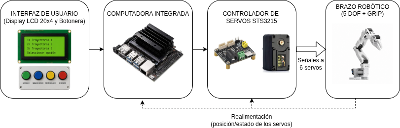

# Documento de respaldo
## Titulo del proyecto
Brazo robótico programable mediante ROS para automatización de tareas repetitivas basado en grabación y reproducción de trayectorias.

## Introducción
El proyecto consiste en el desarrollo de un brazo robótico orientado a la automatización de tareas repetitivas de manipulación de objetos, implementando un sistema básico de programación por demostración (Programming by Demonstration, PbD).

## Objetivo
El objetivo principal es construir un manipulador robótico capaz de aprender trayectorias mediante el movimiento manual realizado por el usuario y posteriormente reproducirlas de forma automática con precisión y repetibilidad.

## Misión
Mi misión es desarrollar una plataforma robótica de bajo costo y alta accesibilidad que elimine la barrera técnica de la programación compleja en entornos industriales y educativos. A través de la implementación de Programación por Demostración (PbD), busco que operarios y estudiantes puedan automatizar tareas de manipulación de forma intuitiva, simplemente "enseñando" al robot mediante el movimiento manual.

## Descripción del equipo
El equipo consiste en un manipulador robótico de 5 grados de libertad (DOF) más un grip (pinza). El hardware se basa en el diseño SO-ARM100, con piezas impresas en 3D (PLA/PETG) y servomotores de precisión Feetech STS3215.

### Diagrama en bloques

- Interfaz de Usuario (Display LCD 20X4 y Botonera): Permite las funciones de grabar, seleccionar, reproducir y borrar trayectorias.
- Computadora Integrada: Ejecuta framework ROS2, gestionando la lógica de cinemática y el almacenamiento de datos.
- Controlador de Servos: Traduce las órdenes de ROS a señales para los 6 motores.
- Actuadores (Servomotores): Ejecutan el movimiento físico del brazo y la pinza.

## Necesidad que cubre
Automatización de tareas de pick-and-place de precisión en líneas de montaje o estaciones de testing electrónico donde el volumen de producción no justifica la inversión en robots industriales de alta gama.

## ¿Cómo actualmente resuelve la necesidad el usuario del producto a realizar?
Actualmente, las opciones en el mercado se dividen en:
- Trabajo manual: Sujeto a fatiga, errores humanos y menor velocidad constante.
- Robots industriales (ej. KUKA): Altamente costosos, requieren personal especializado en programación y una infraestructura compleja.
- Kits educativos simples: No poseen la precisión necesaria para tareas industriales ni cuentan con la robustez de un ecosistema como ROS.

Este proyecto se posiciona en el punto medio: precisión industrial con simplicidad de uso doméstico.

## Análisis FODA
### Fortalezas
- Uso de ROS (estándar de la industria).
- Costo reducido por fabricación 3D.
- Programación kinestésica intuitiva.

### Oportunidades
- Creciente demanda de automatización en PyMEs.
- Posibilidad de expansión futura (visión/IA).
- Entornos educativos interesados en robótica.

### Debilidades
- Limitación de carga (objetos livianos).
- Dependencia de calidad de impresión 3D.
- Interfaz inicial solo por botones (sin aplicación de escritorio).

### Amenazas
- Competencia de kits chinos de bajo costo.
- Inestabilidad en costos de componentes importados (servomotores y controlador).

## Descripción del desafío tecnológico a resolver
El mayor desafío consiste en la implementación de la lógica de grabación y reproducción sincronizada en ROS. Esto implica capturar los estados de los servomotores en tiempo real mientras el operario los mueve (modo líder), filtrar el ruido de los sensores y reproducirlos con suavidad y precisión (modo seguidor) sin comprometer la estabilidad del sistema.

